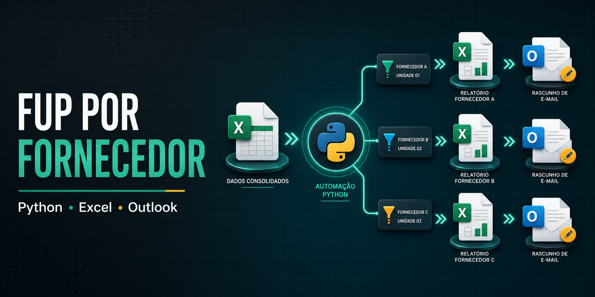

# Automação de FUP por fornecedor e unidade

Projeto de portfólio em Python que segmenta uma base de pendências por fornecedor e unidade, gera uma planilha individual e prepara uma mensagem no Microsoft Outlook com o relatório correto anexado.

## Fluxo

1. Lê a aba `Base Fup` de uma planilha local.
2. Identifica combinações únicas de fornecedor e unidade.
3. Gera um arquivo Excel contendo apenas as linhas daquele destinatário.
4. Remove colunas internas configuradas e padroniza a apresentação.
5. Localiza destinatários em um CSV separado.
6. Cria um rascunho no Outlook; o envio exige a opção explícita `--enviar`.

## Como executar

Requisitos: Windows, Outlook desktop configurado e Python 3.10+.

```powershell
python -m venv .venv
.venv\Scripts\activate
pip install -r requirements.txt
python src/gerar_fups_outlook.py --base caminho\base_fup.xlsx --contatos examples\contatos_exemplo.csv --saida output
```

Por padrão, nenhuma mensagem é enviada. Revise os rascunhos e os anexos. Use `--enviar` somente em ambiente controlado e após validar os destinatários.

## Privacidade e segurança

Esta versão não contém nomes, e-mails, telefones, caminhos locais, remetentes, cópias, bases ou dados operacionais reais. O `.gitignore` bloqueia planilhas e logs por padrão; a amostra de contatos usa domínios reservados `.test`.

## Tecnologias

Python, `openpyxl`, automação COM do Outlook (`pywin32`) e CSV.
